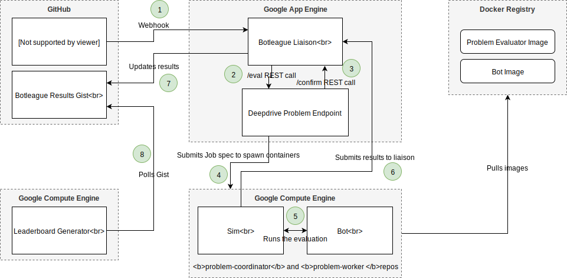

# Botleague

## Open league for AI competition

This repo coordinates an open league where bots are ranked on a set of community 
contributed problems. We provide an ongoing leaderboard of the best bots in the 
world on the problems and challenges submitted. Anyone can submit
a problem and and anyone can submit a bot.

Bots are ranked and displayed on the [botleague.io](https://botleague.io) [(source and data)](https://github.com/botleague/leaderboard-generator).

We provide a reference implementation of bots and problems via Deepdrive, and [TBA].

### Conceived for self-driving

The league was conceived specifically for self-driving where industry feedback to academia is limited, despite academia being the major contributor of new algorithms to self-driving.
With Botleague, a self-driving car company can present it's toughest problems directly to the public and 
to academia to compete on. 

### Generality

Generality across problems is a key component of the way the league is structured, 
where bots list a set of problems they can solve. Crucially, these problems
can be within completely different simulators on different machines architectures, etc... 
So if  a self-driving car company wants to test a neural net on its ASIC hardware,
it can pull the docker container containing the weights, compile the net
and evaluate it. The platform is agnostic to both bot and problem implementation.
In this way Botleague is a general API for AI competition.

### How it works

*High level* 

Submit a docker container with your bot and problems it solves, 
and get ranked on botleague.io.

*Low level*

Pull requests to [bots](bots) in this repo trigger evaluation on the set of [problems](problems) designated in its bot.json. Pull requests are then evaluated, ranked on the leaderboards, and merged so long as they are in the correct format. Bots include a docker container and optionally writeups and source code that are pulled in and tested by problem evaluators. Anyone can contribute a problem, so long as they support the [minimal API](#problem-endpoints). Example problem evaluators are currently Deepdrive and [TBA]. To create a problem within one the problem providers, refer to the docs of that provider.

#### Example flow: Deepdrive evaluation in Botleague



#### Reproducibility 

Reproducibility is core to making progress in research, and we currently put the onus of that on the problem implementations, although we may implement this functionality in Botleague at some point.

For example Deepdrive kicks off **five** simultaneous runs for each evaluation, and uses the median score, video, recording for the final score (also returning the scores, videos, and recordings for each of the five).

#### Overfitting

We are working on ways to prevent overfitting in collaboration with [TBA], including the use of their [adversarial search](http://web.stanford.edu/~hnamk/papers/OKellySiNaDuTe18.pdf) or just simple fuzzing of given parameters in order to more rigorously test submissions, esp. in the case of things like annual challenges where prize money is offerred. In Deepdrive, this will mean randomly varying other vehicles, lighting, handling, surface friction, actuation randomness, etc...

## Bots

To submit a bot, send a pull request to this repo with a bot.json under [bots](bots)/{github-name}/{repo-name} - with a [bot.json](crizcraig/forward-bot/bot.json) to have your bot 
evaluated and ranked on the leaderboards.
 
You must push the docker tag referred to in your bot.json before submitting the pull request.
 

## Problems

A list of problems to test your bot against can be found
in [problems](problems).

TODO: Link to problems page on leaderboards site to give an idea of what they involve

A bot-league compatible endpoint mush be included in a new problem.

### Problem Endpoints

Problem endpoints implement a simple API, accepting one request and sending a confirmation then results to liaison.botleague.io. An example problem endpoint can be found at https://github.com/deepdrive/problem-endpoint

#### 1. Accept `/eval` POST

The request will come in to the endpoint defined in your problem.json definition, i.e.:
 
```
https://sim.deepdrive.io/eval/domain_randomization
```

with JSON payload containing the following:

`seed`: A random number between 0 and 1 million. This is broadcast to all of 
the problem evaluators for the bot submission.

`eval_key`: Secret problem evaluation key unique to the evaluation of the bot 
on this problem. Used to communicate back to liaison in `/confirm` and `/results` requests.

`docker_tag`: i.e. `your-dockerhub-name/your-bot` or `gcr.io/your-dockerhub-name/your-bot`

`pull_request`: i.e.:
```
  "pull_request": {
    "url": "https://api.github.com/repos/deepdrive/botleague/pulls/4",
    "number": 4,
    "updated_at": "2019-05-21T21:45:51Z",
    "merge_commit_sha": "50f0f2d44e836f30d2815141c866cd2775bb8ec6",
    "head_commit": "4dd65418bef710f5e668c33205040d6f40e7ef43",
    "head_full_name": "deepdrive/botleague",
    "base_commit": "a1e475acfe1218482e27fb013317dd01e0fbfcbf",
    "base_full_name": "deepdrive/botleague"
  }
```

#### 2. Send `/confirm` POST

Problem evaluators then need to send a confirmation POST request with the `eval_key` in the data payload encoded as JSON to 

```https://liaison.botleague.io/confirm``` 

to verify that botleague indeed initiated the evaluation.

An example payload would be:

```
{
  "eval_key": "4UHHRJB9SDIAZ7BKE63B4R4I3"
}
```

#### 3. Send `results` POST

Finally evaluators POST `results` JSON to `https://liaison.botleague.io/results` 
with the `eval_key` to complete the evaluation and to be 
included on the leaderboards.

```
{
  "eval_key": "4UHHRJB9SDIAZ7BKE63B4R4I3",
  "results": {
      "score": -11.030770867917356,
      "youtube": "https://www.youtube.com/watch?v=ebsdDI56LXE",
      "mp4": "https://s3-us-west-1.amazonaws.com/deepdrive/artifacts/2019-05-27__04-06-45PM_48fc/mp4/deepdrive_2019-05-27__04-06-45PM.mp4",
      "gist": "https://gist.github.com/f2d73b721cdb7db33a5dbeca4af47441",
      "logs": "https://storage.googleapis.com/deepdriveio/botleague_eval_logs/TEST_JOB.txt",
      "sensorimotor_specific": {
        "num_episodes": 1,
        "average_fps": 0.007863683665802961,
        "num_steps": 101
      },
      "driving_specific": {
        "max_gforce": 0.5548695018061894,
        "max_kph": 68.00625000000001,
        "avg_kph": 35.75995586886264
      },
      "problem_specific": {
        "summary": "https://s3-us-west-1.amazonaws.com/deepdrive/artifacts/csvs/2019-05-27__04-06-45PM_48fc/2019-05-27__04-06-45PM_r0_summary.csv",
        "episodes": "https://s3-us-west-1.amazonaws.com/deepdrive/artifacts/csvs/2019-05-27__04-06-45PM_r1_episodes.csv",
        "observations": [
          "https://s3-us-west-1.amazonaws.com/deepdrive/artifacts/2019-05-27__04-06-45PM_48fc/hdf5_obvservations/0000000000.hdf5"
        ]
      }
  }
}
```

If there was an error in the evaluation, return an error field with the eval_key
as in the following:

```
{
  "eval_key": "4UHHRJB9SDIAZ7BKE63B4R4I3",
  "error": "some error message"
}
```

### Problem versioning

In order to support testing new versions of problems (i.e. some new sim commit), we will rerun ranked bots (or some number of the top bots) and ensure that ranking is stable and optionally that scores are consistent with the previous ones.

#### Flow

When a problem definition changes, Botleague will perform a **Problem CI** where all ranked bots are retested against the new problem version. If another problem update comes in while a problem CI is in progress, it will wait until the intermediate version finishes. When all bots are finished, scores and ranks will be compared, and PASS/FAIL will be determined via deviation from the previous version per the problem definition.

#### Cases for new rank ordering

##### Rank ordering is the same on new and previous version (common case)

**Resolution:** The new problem version becomes the default version, old scores are stored along with the problem.json commit and new scores are the default scores shown on the leaderboards. Points will be based soley from ranking, not score values, so the users' and bots' points will not change.


##### Rank ordering changes

**Resolution:** Eval/CI fails, problem.json updated with `"archived": true`, and new bot submissions will be disabled for this problem. Problem endpoints can create a new problem if they intended for this change, in which case the old problem will remain archived, or fix the bug and submit a pull request with `"archived": false` in problem.json to trigger another **Problem CI Run**. If the rank ordering changes on a bot pull request, as opposed to a problem pull request, we pause bot submissions on the problem in the same way, and notify the `problem.json` `"contact"` that the problem has been archived until the original ranking has been restored. 

We will avoid requiring score parity for now across problem versions. We will copy bot containers, so will always be able to test the old bots and get new scores.

## Challenges

Challenges are sets of problems a bot is tasked with generalizing across.
